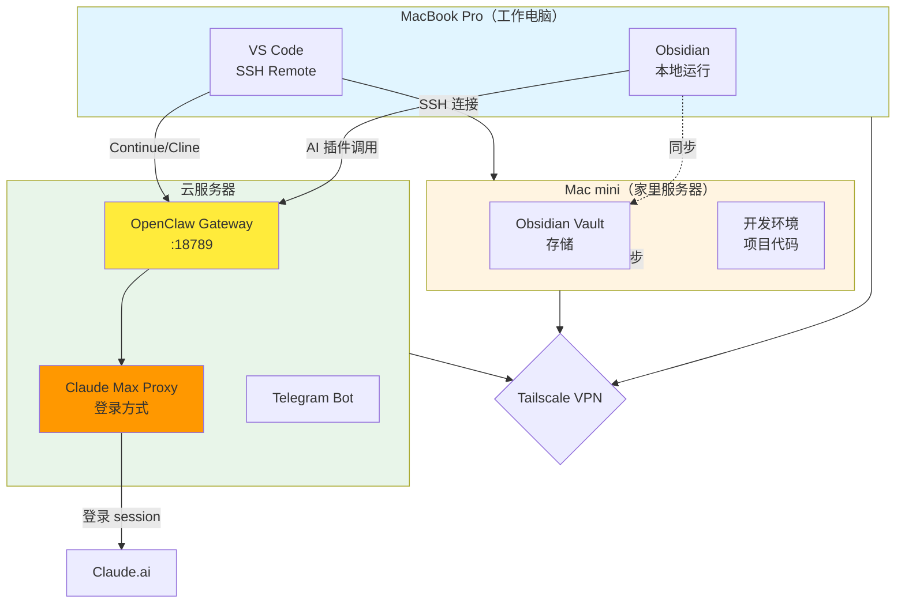
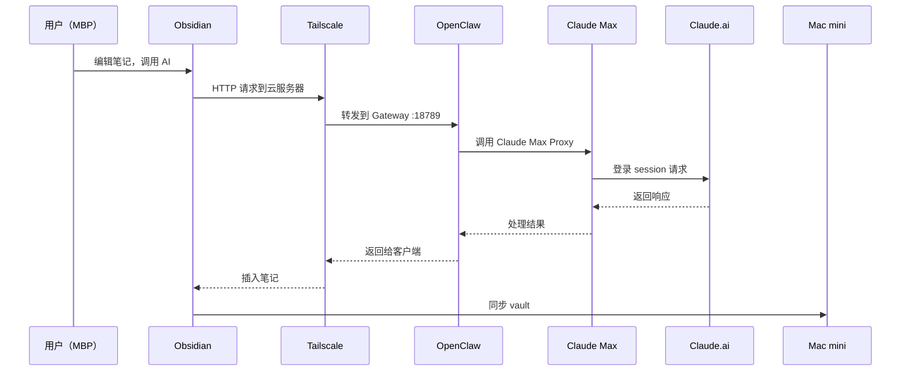

# OpenClaw 多端整合方案文档

> **作者：** 金哥  
> **创建日期：** 2026-02-15  
> **版本：** v1.0  
> **目的：** 统一 AI 调用，降低成本，提升效率

---

## 📋 目录

1. [核心理念](#核心理念)
2. [架构概览](#架构概览)
3. [设备配置](#设备配置)
4. [工作流程](#工作流程)
5. [成本对比](#成本对比)
6. [配置清单](#配置清单)
7. [常见问题](#常见问题)

---

## 🎯 核心理念

**问题：**
- 工作电脑（MBP）需要保持轻量，不装大模型
- 多个工具（Obsidian、VS Code）需要 AI 支持
- Claude Max 订阅已有，但需要多端复用
- 避免重复配置 API key，统一管理

**解决方案：**
- ✅ 一个 OpenClaw Gateway 服务所有客户端
- ✅ 一个 Claude Max 账号（登录方式）
- ✅ 通过 Tailscale VPN 打通所有设备
- ✅ 零额外成本，统一入口

---

## 🏗️ 架构概览

### 整体架构图



### 数据流向图



---

## 💻 设备配置

### 1️⃣ MacBook Pro（工作电脑）

**角色：** 轻量化客户端

**运行软件：**
- ✅ Obsidian（本地/同步）
- ✅ VS Code（SSH Remote 到 Mac mini）
- ✅ Tailscale（VPN 客户端）

**特点：**
- ❌ 不装大模型
- ❌ 不存储大型 vault（仅同步）
- ❌ 不运行重型开发环境

**配置：**

#### Obsidian 插件（Text Generator / Copilot）
```yaml
API Base URL: http://[云服务器 Tailscale IP]:18789/v1
API Key: fdefab2e7ed757595b49de9fd04625af275c0b05ccadd69f
Model: openclaw:main
```

#### VS Code 插件（Continue / Cline）

**选项 A：** 直接 Tailscale
```json
{
  "apiBase": "http://[云服务器 Tailscale IP]:18789/v1",
  "apiKey": "fdefab2e7ed757595b49de9fd04625af275c0b05ccadd69f",
  "model": "openclaw:main"
}
```

**选项 B：** SSH 端口转发（更简单）
```bash
# ~/.ssh/config
Host mac-mini
  HostName [Mac mini IP]
  LocalForward 18789 [云服务器 Tailscale IP]:18789
```

然后插件配置：
```json
{
  "apiBase": "http://127.0.0.1:18789/v1",
  "apiKey": "fdefab2e7ed757595b49de9fd04625af275c0b05ccadd69f",
  "model": "openclaw:main"
}
```

---

### 2️⃣ Mac mini（家里服务器）

**角色：** 存储 + 开发环境

**运行内容：**
- ✅ Obsidian Vault（24小时存储）
- ✅ 开发项目（代码仓库）
- ✅ Tailscale（连接 VPN）

**特点：**
- ✅ 24小时开机
- ✅ 稳定存储
- ✅ VS Code Remote 目标

**同步方案：**
- **方案 1：** iCloud Drive 自动同步
- **方案 2：** Syncthing（开源，更可控）
- **方案 3：** SMB 网络共享

---

### 3️⃣ 云服务器

**角色：** AI 中枢

**运行服务：**
- ✅ OpenClaw Gateway (:18789)
- ✅ Claude Max Proxy（登录方式）
- ✅ Telegram Bot
- ✅ Tailscale（VPN 节点）

**配置要点：**

#### OpenClaw 配置
```json
{
  "gateway": {
    "port": 18789,
    "bind": "loopback",
    "tailscale": {
      "mode": "serve"
    },
    "auth": {
      "mode": "token",
      "allowTailscale": true
    },
    "http": {
      "endpoints": {
        "chatCompletions": {
          "enabled": true
        }
      }
    }
  },
  "agents": {
    "defaults": {
      "model": {
        "primary": "anthropic/claude-sonnet-4-5"
      }
    }
  }
}
```

#### Claude Max 配置
- 通过 `claude-max-api-proxy` 等工具
- 维护登录 session
- 无需 API key，订阅制

---

## 🔄 工作流程

### 场景 1：在 Obsidian 整理笔记


**步骤：**
1. 在 MBP Obsidian 打开笔记
2. 选中需要处理的文字
3. 调用插件（快捷键或右键菜单）
4. 插件通过 Tailscale 调用云服务器 OpenClaw
5. OpenClaw 转发到 Claude Max
6. 结果返回并插入笔记
7. 自动同步到 Mac mini vault

---

### 场景 2：在 VS Code 写代码/文档


**步骤：**
1. MBP VS Code → SSH Remote → Mac mini
2. 打开项目，编辑代码
3. Continue/Cline 插件调用 OpenClaw
4. 获得代码建议/文档生成
5. 直接插入编辑器

---

### 场景 3：Telegram 聊天


**步骤：**
1. 在 Telegram 发送消息
2. Bot 转发到 OpenClaw
3. Claude Max 处理
4. 回复返回 Telegram

---

## 💰 成本对比

### 之前的方案（分散配置）

| 工具 | 配置方式 | 成本 |
|------|----------|------|
| Obsidian | Cloudian 插件 → Claude API | $20/月（重复） |
| VS Code | Claude 插件 → Claude API | $20/月（重复） |
| Telegram | OpenClaw → Claude API | $20/月（已有） |
| **总成本** | **重复配置，管理混乱** | **$60/月** ❌ |

---

### 现在的方案（统一入口）

| 工具 | 配置方式 | 成本 |
|------|----------|------|
| Obsidian | OpenClaw API → Claude Max | $0 |
| VS Code | OpenClaw API → Claude Max | $0 |
| Telegram | OpenClaw → Claude Max | $0 |
| **OpenClaw + Claude Max** | **一个订阅** | **$20/月** ✅ |

**节省：** $40/月 = $480/年 🎉

---

## 📝 配置清单

### ✅ 已完成

- [x] 云服务器安装 OpenClaw
- [x] 配置 Claude Max Proxy
- [x] 启用 OpenAI 兼容 HTTP API (`/v1/chat/completions`)
- [x] 配置 Tailscale Serve 模式
- [x] Telegram Bot 配置

### 🔲 待完成

- [ ] MBP 安装 Tailscale 客户端
- [ ] Mac mini 安装 Tailscale 客户端
- [ ] Mac mini 配置 Obsidian Vault 同步（iCloud/Syncthing/SMB）
- [ ] MBP Obsidian 安装插件（Text Generator / Copilot）
- [ ] MBP VS Code 安装插件（Continue / Cline）
- [ ] 测试 Obsidian 调用 OpenClaw
- [ ] 测试 VS Code 调用 OpenClaw

---

## 🔧 配置参数速查

### 云服务器信息

```bash
# 获取 Tailscale IP
tailscale ip -4

# 获取机器名
tailscale status
```

### OpenClaw API 信息

```yaml
Endpoint: http://[云服务器 Tailscale IP]:18789/v1/chat/completions
Token: fdefab2e7ed757595b49de9fd04625af275c0b05ccadd69f
Model: openclaw:main
```

### 插件配置模板

**Obsidian Text Generator：**
```
Provider: Custom (OpenAI-compatible)
API Base: http://[云服务器 Tailscale IP]:18789/v1
API Key: fdefab2e7ed757595b49de9fd04625af275c0b05ccadd69f
Model: openclaw:main
```

**VS Code Continue：**
```json
{
  "models": [{
    "title": "OpenClaw (Claude Max)",
    "provider": "openai",
    "model": "openclaw:main",
    "apiBase": "http://[云服务器 Tailscale IP]:18789/v1",
    "apiKey": "fdefab2e7ed757595b49de9fd04625af275c0b05ccadd69f"
  }]
}
```

---

## ❓ 常见问题

### Q1: 为什么不直接在 MBP 上运行 OpenClaw？

**A:** 
- MBP 是工作电脑，需要保持轻量
- 云服务器 24小时运行，稳定性更好
- Claude Max Proxy 需要保持登录 session

### Q2: Tailscale 安全吗？

**A:**
- ✅ 端到端加密
- ✅ Zero Trust 架构
- ✅ 只有你的设备能访问
- ✅ 比公网暴露安全 100 倍

### Q3: 如果云服务器挂了怎么办？

**A:**
- 备用方案：在 Mac mini 上也运行一个 OpenClaw
- 或者临时切换到官方 Claude API
- Obsidian/VS Code 插件支持快速切换 endpoint

### Q4: 同步延迟会影响体验吗？

**A:**
- Tailscale 延迟通常 <50ms
- OpenClaw 响应时间主要取决于 Claude
- 实际使用几乎无感

### Q5: 可以添加其他设备吗？

**A:**
- ✅ 可以！只要加入 Tailscale 网络
- 比如 iPad、iPhone（通过 Obsidian Mobile）
- 配置相同的 OpenClaw endpoint 即可

---

## 🎉 总结

### 核心优势

1. **统一入口** - 一个 OpenClaw 服务所有客户端
2. **零重复成本** - 复用 Claude Max 订阅
3. **轻量化工作电脑** - MBP 保持干净高效
4. **安全访问** - Tailscale VPN 加密通信
5. **灵活扩展** - 随时添加新设备/新工具

### 适用场景

- ✅ 重度 Obsidian 用户（整理笔记、知识管理）
- ✅ 开发者（VS Code 写代码需要 AI 辅助）
- ✅ 多设备工作（MBP + Mac mini + 云服务器）
- ✅ 已有 Claude Max 订阅
- ✅ 追求成本优化

---

**文档更新日期：** 2026-02-15  
**维护者：** 金哥 + 紫龙 🐉
